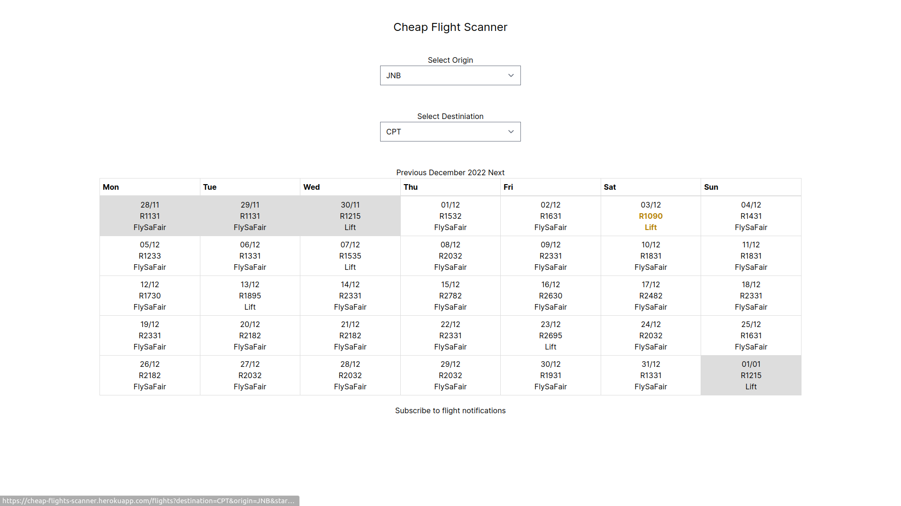

# Cheap Flight Scanner South Africa

> Scans for cheap flights from South African local airlines and notifies you via email.

## Screenshot

## Built With

- Ruby
- Ruby On Rails
- Tailwind CSS
- Postgres

## Live Demo

[Live Demo Link](https://fortunate-emelina-cerdtruir.koyeb.app/)

## Getting Started

To get a local copy up and running follow these simple example steps.

### Prerequisites

- Ruby: 3.1.2
- Rails: 7.0.4

### Setup

- Clone the repository
- Run `bundle install`
- Run `rails db:create`
- Run `rails db:migrate`
- Add your own credentials to .env file
  `EMAIL_USERNAME`,
  `EMAIL_PASSWORD`,
  `SITE_URL`

### Usage

- Run `rails server`
- Open `http://localhost:3000/` in your browser

### Deployment

- Deploy with heroku or your preferred hosting service

## Authors

👤 **N Ghoor**

- GitHub: [@Cerdtruir](https://github.com/Cerdtruir)

## 🤝 Contributing

Contributions, issues, and feature requests are welcome!

Feel free to check the [issues page](../../issues/).

## Show your support

Give a ⭐️ if you like this project!

## 📝 License

This project is [MIT](./LICENSE) licensed.
